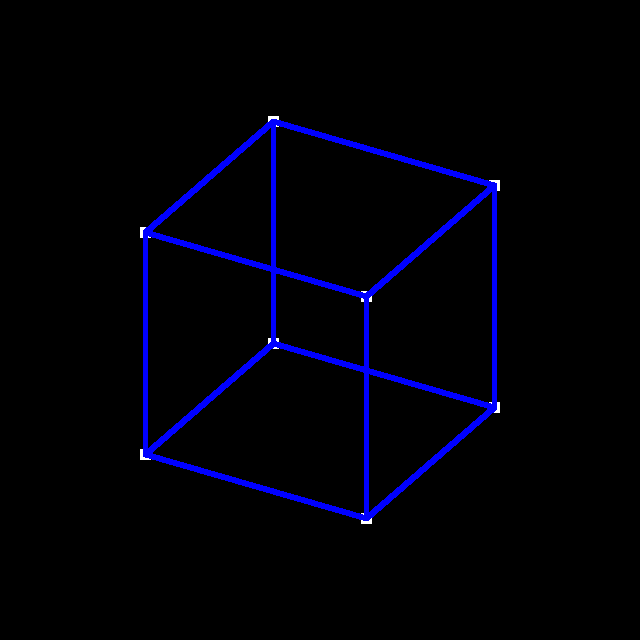

# Cube Projection

Transforms a matrix of 3D Cube coordinates with Eigen3 and visualizes the results with SDL2

## Controls:
- U/D/L/R arrows: Rotates the cube in the direction specified by the arrow
- ESC: quit program

## Requirements
- Eigen3
- SDL2

### Ubuntu Linux / WSL
`sudo apt install libeigen3-dev libsdl2-dev`

### Fedora
`sudo dnf install eigen3-devel SDL2-devel`

### Arch btw
`pacman -S eigen sdl2`

### macOS (Homebrew)
`brew install eigen3 sdl2`

## Building and Running
Just run `make` and execute `./cube-projection`. If you're having issues, make sure you have the right dependencies and your compiler knows where to find the dependencies.
